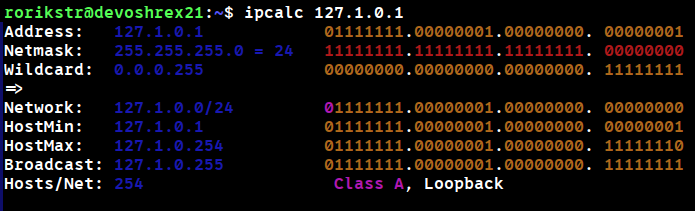
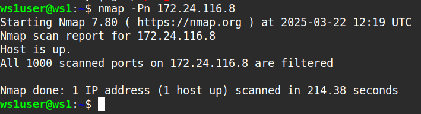
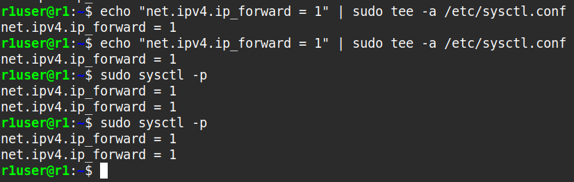
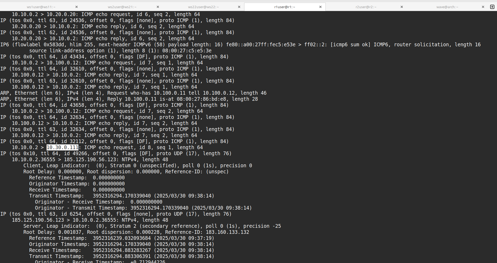
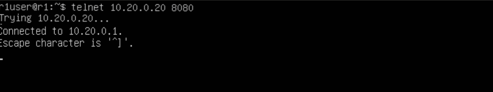

# Сети в Linux

Настройка сетей в Linux на виртуальных машинах.


## Chapter I

 */proc/net/route*. 
Просмотреть текущую таблицу маршрутизации можно командой `netstat -rn` (r — routing table, n — не преобразовывать IP в имена), `route` или `ip r`.

Пример таблицы маршрутизации для хоста eggplant:
```
[root@eggplant ~]# netstat -rn
Kernel IP routing table
Destination     Gateway         Genmask         Flags   MSS Window  irtt Iface
128.17.75.0      128.17.75.20   255.255.255.0   UN        1500 0          0 eth0
default          128.17.75.98   0.0.0.0         UGN       1500 0          0 eth0
127.0.0.1        127.0.0.1      255.0.0.0       UH        3584 0          0 lo
128.17.75.20     127.0.0.1      255.255.255.0   UH        3584 0          0 lo
```

Значения колонок:
- Destination — адреса сетей (хостов) назначения. При этом, при указании сети, адрес обычно заканчивается на ноль;
- Gateway — адрес шлюза для указанного в первой колонке хоста/сети. Третья колонка — маска подсети, для которой работает данный маршрут;
- Flags — информация об адресе назначения (U — маршрут работает, N — маршрут для сети, H — маршрут для хоста и т. п.);
- MSS — число байтов, которое может быть отправлено за 1 раз; 
- Window — количество фреймов, которое может быть отправлено до получения подтверждения;
- irtt — статистика использования маршрута;
- Iface — указывает сетевой интерфейс, используемый для маршрута (eth0, eth1 и т. п.).

\> *Как и в прошлый раз, ещё больше полезной информации ты найдешь в папке materials.*


## Chapter III

В качестве результата работы ты должен представить отчет по выполненным задачам. В каждой части задания указано, что должно быть помещено в отчёт после её выполнения. Это могут быть ответы на вопросы, скриншоты и т. д.
- В репозиторий, в папку src, должен быть загружен отчёт с расширением .md.
- В отчёте должны быть выделены все части задания как заголовки 2-го уровня.
- В рамках одной части задания всё, что помещается в отчёт, должно быть оформлено в виде списка.
- Каждый скриншот в отчёте должен быть кратко подписан (что показано на скриншоте).
- Все скриншоты обрезаны так, чтобы была видна только нужная часть экрана.
- На одном скриншоте допускается отображение сразу нескольких пунктов задания, но они все должны быть описаны в подписи к скриншоту.
- На все виртуальные машины, созданные в процессе выполнения задания, устанавливай **Ubuntu 20.04 Server LTS**.

Список утилит: `ipcalc`, `ip`, `netplan`, `netstat`, `iperf3`, `iptables`, `ping`, `nmap`, `sysctl`, `tcpdump`, `traceroute`, `systemctl`, `telnet`, `dhclient`.

## Part 1. Инструмент **ipcalc**
`-` Итак, начнём наше погружение в удивительный мир сетей со знакомства с IP-адресами. А использовать для этого мы будем инструмент **ipcalc**.

**== Задание ==**

##### Подними виртуальную машину (далее -- ws1)

#### 1.1. Сети и маски
##### Определи и запиши в отчёт:
##### 1) Адрес сети *192.167.38.54/13*

>(для себя. как считать маску, пример)

>11111100 = 128 + 64 + 32 + 16 + 8 + 4 + 2 + 0 = 252.


Адрес сети: 192.160.0.0/13


##### 2) Перевод маски *255.255.255.0* в префиксную и двоичную запись, */15* в обычную и двоичную, *11111111.11111111.11111111.11110000* в обычную и префиксную

  `ipcalc 255.255.255.0`

255.255.255.0:
    prefix: /24
    binary: 11111111.11111111.11111111.00000000

  `ipcalc /15`

/15:
    Default: 255.254.0.0
    binary: 11111111.11111110.00000000. 00000000

а вот тут уже ipcalc не сработал, но всего единиц доступно 8*4 = 32. А здесь у нас не хватает всего 4-х единиц, значит просто 32-4=28. Это и будет число для префиксной записи.

  `ipcalc /28`

11111111.11111111.11111111.11110000:
    default: 255.255.255.240 
    prefix: /28

##### 3) Минимальный и максимальный хост в сети *12.167.38.4* при масках: */8*, *11111111.11111111.00000000.00000000*, *255.255.254.0* и */4*

    >Пример Расчет диапазона. Теория.

    10.10.0.0/18
    a Переведи IP-адрес в двоичный вид  

    10.10.0.0 в двоичном виде: 

    `00001010.00001010.00000000.00000000`

    b Примени маску  

    Маска /18 в двоичном виде: 

    `11111111.11111111.11000000.00000000`

    Применим маску к IP-адресу:

        00001010.00001010.00000000.00000000 (IP-адрес)
        AND
        11111111.11111111.11000000.00000000 (маска)

        Результат:
        00001010.00001010.00000000.00000000 = 10.10.0.0 (адрес сети).

    c Найди HostMin и HostMax  

    HostMin : Адрес сети + 1. 


    `10.10.0.0 + 1 = 10.10.0.1`

    HostMax : Последний доступный хост перед Broadcast Address.

    `10.10.63.255 - 1 = 10.10.63.254`
    
    d Broadcast Address  

    Broadcast Address — это адрес, где все биты после префикса установлены в 1.
    
    00001010.00001010.00000000.00000000 (IP-адрес)  
    OR
    00000000.00000000.00111111.11111111 (инверсия маски)  

    Результат:
    00001010.00001010.00111111.11111111 = 10.10.63.255 (Broadcast Address).

Решение

Маска /18 в двоичном виде: 

11111111.11111111.11000000.00000000

12.167.38.4/8

`~> ipcalc 12.167.38.4/8 | grep "HostMax"`

    HostMax:   12.255.255.254       00001100. 11111111.11111111.11111110

`~> ipcalc 12.167.38.4/8 | grep "HostMin"`

    HostMin:   12.0.0.1             00001100. 00000000.00000000.00000001


12.167.38.4/16 (11111111.11111111.00000000.00000000)

`~> ipcalc 12.167.38.4/16 | grep HostMin`

    HostMin:   12.167.0.1           00001100.10100111. 00000000.00000001

`~> ipcalc 12.167.38.4/16 | grep HostMax`

    HostMax:   12.167.255.254       00001100.10100111. 11111111.11111110


12.167.38.4/23 (255.255.254.0)

`~> ipcalc 12.167.38.4/23 | grep "HostMin"`

    HostMin:   12.167.38.1          00001100.10100111.0010011 0.00000001

`~> ipcalc 12.167.38.4/23 | grep "HostMax"`

    HostMax:   12.167.39.254        00001100.10100111.0010011 1.11111110


#### 1.2. localhost
##### Определи и запиши в отчёт, можно ли обратиться к приложению, работающему на localhost, со следующими IP:
*194.34.23.100*, *127.0.0.2*, *127.1.0.1*, *128.0.0.1*

Через Hosts/Net при выводе в ipcalc. lo -

lo - виртуальный loopback девайс который есть во всех системах его адрес - localhost 127.0.0.1
нужен для подключения и взаимодействия сетевых сервисов локально на одной машине.

вот он нам и нужен. Он позволяет обратиться к приложению рабтоающему на localhost.

194.34.23.100 - нет, нет пометки lo


127.0.0.2 - да, можно, lo присутствует


127.1.0.1 - да



#### 1.3. Диапазоны и сегменты сетей
##### Определи и запиши в отчёт:
##### 1) Какие из перечисленных IP можно использовать в качестве публичного, а какие только в качестве частных: 
*10.0.0.45*, *134.43.0.2*, *192.168.4.2*, *172.20.250.4*, *172.0.2.1*, *192.172.0.1*, 
*172.68.0.2*, *172.16.255.255*, *10.10.10.10*, *192.169.168.1*

>Частные IP-адреса — это диапазоны, зарезервированные для использования внутри локальных сетей (например, домашних или корпоративных). Они не могут быть использованы напрямую в интернете.

Зарезервированные частные диапазоны (RFC 1918): 

    10.0.0.0/8 : 10.0.0.0 – 10.255.255.255.
    172.16.0.0/12 : 172.16.0.0 – 172.31.255.255.
    192.168.0.0/16 : 192.168.0.0 – 192.168.255.255.

>Публичные IP-адреса — это адреса, которые уникальны в глобальной сети (интернете) и могут быть использованы для прямого соединения между устройствами через интернет.
     
    Почему есть разделение на частные и публичные IP?  
    a Экономия адресов  

        IPv4 имеет ограниченное количество адресов (~4.3 млрд).
        Частные диапазоны позволяют многим сетям использовать одинаковые адреса без конфликтов.
        

    b Безопасность  

        Частные IP-адреса защищают твою локальную сеть от непосредственного доступа из интернета.
        Для доступа к локальным устройствам из интернета используется специальная настройка (например, проброс портов).
     

10.0.0.45       - частная  
134.43.0.2      - публичная  
192.168.4.2     - частная  
172.20.250.4    - частная  


172.68.0.2      -   публичная  
172.16.255.255  -   частная  
10.10.10.10     -   частная  
192.169.168.1   -   публичная  


##### 2) Какие из перечисленных IP-адресов шлюза возможны у сети *10.10.0.0/18*: 
*10.0.0.1*,  
*10.10.0.2*,  
*10.10.10.10*,  
*10.10.100.1*,  
*10.10.1.255*

>решение с этим значением (10.10.0.0/18) уже рассчитывал вручную, теперь снова определим с помощью ipcalc hostmin и hostmax соответственно.


HostMin:   10.10.0.1
HostMax:   10.10.63.254

соответственно входящими в диапазон будут

```
10.10.0.2
10.10.10.10
```

Остальные не входят в диапазон


## Part 2. Статическая маршрутизация между двумя машинами

`-` Теперь разберёмся, как связать две машины, используя статическую маршрутизацию.

**== Задание ==**

##### Подними две виртуальные машины (далее -- ws1 и ws2).

##### С помощью команды `ip a` посмотри существующие сетевые интерфейсы.
- В отчёт помести скрин с вызовом и выводом использованной команды.


Основные различия между ws1 и ws2: 

    MAC-адреса  интерфейсов enp0s3 различаются.
    Время жизни IP-адресов  (valid_lft и preferred_lft) немного отличается из-за разных моментов получения адресов.  


##### Опиши сетевой интерфейс, соответствующий внутренней сети, на обеих машинах и задай следующие адреса и маски: ws1 — *192.168.100.10*, маска */16*, ws2 — *172.24.116.8*, маска */12*.
- В отчёт помести скрины с содержанием изменённого файла *etc/netplan/00-installer-config.yaml* для каждой машины.

вторым адаптером ставим internal network в virtualbox

```
enp0s10:
| | |
v | |
en| |   --> ethernet
  v |
  p0|   --> bus number (0)
    v
    s10 --> slot number (10)
```

https://github.com/systemd/systemd/blob/ccddd104fc95e0e769142af6e1fe1edec5be70a6/src/udev/udev-builtin-net_id.c#L29

для ws1

```yaml
# This is the network config written by 'subiquity'
network:
  version: 2
  ethernets:
    enp0s3:
      dhcp4: true
    enp0s8:  # Второй адаптер (Internal Network).
      dhcp4: false
      addresses:
        - 192.168.100.10/16
      nameservers:
        addresses:
          - 8.8.8.8
```

Там где мы вставили 192.168.0.1 - это HostMin для 192.168.100.10/16

Большинство роутеров и систем автоматически назначают шлюзам адреса из начала диапазона. Поэтому HostMin

ws2

```yaml
# This is the network config written by 'subiquity'
network:
  version: 2
  ethernets:
    enp0s3:
      dhcp4: true
    enp0s8:  # Второй адаптер (Internal Network).
      dhcp4: false
      addresses:
        - 172.24.116.8/12
      nameservers:
        addresses:
          - 8.8.8.8

```


##### Выполни команду `netplan apply` для перезапуска сервиса сети.
- В отчёт помести скрин с вызовом и выводом использованной команды.


#### 2.1. Добавление статического маршрута вручную
##### Добавь статический маршрут от одной машины до другой и обратно при помощи команды вида `ip r add`.
ws1   
`sudo ip route add 172.24.116.8 dev enp0s8`   
ws2   
`sudo ip route add 192.168.100.10 dev enp0s8`   


##### Пропингуй соединение между машинами.
- В отчёт помести скрин с вызовом и выводом использованных команд.

ws1   
`ping 172.24.116.8`

ws2   
`ping 192.168.100.10`   


#### 2.2. Добавление статического маршрута с сохранением
##### Перезапусти машины.
##### Добавь статический маршрут от одной машины до другой с помощью файла */etc/netplan/00-installer-config.yaml*.

Проверяем, что после перезагрузки ping не работает   


Поэтому просто в .yaml файл добавляем routes.

ws1  
```yaml
network:
  version: 2
  ethernets:
    enp0s3:
      dhcp4: true
    enp0s8:
      dhcp4: false
      addresses:
        - 192.168.100.10/16
      routes:
        - to: 172.24.116.8
          via: 192.168.100.10
      nameservers:
        addresses:
          - 8.8.8.8
```

ws2  
```yaml
network:
  version: 2
  ethernets:
    enp0s3:
      dhcp4: true
    enp0s8:
      dhcp4: false
      addresses:
        - 172.24.116.8/12
      routes:
        - to: 192.168.100.10
          via: 172.24.116.8
      nameservers:
        addresses:
          - 8.8.8.8

```

- В отчёт помести скрин с содержанием изменённого файла */etc/netplan/00-installer-config.yaml*.


##### Пропингуй соединение между машинами.
- В отчёт помести скрин с вызовом и выводом использованной команды.


## Part 3. Утилита **iperf3**

**== Задание ==**

*В данном задании используются виртуальные машины ws1 и ws2 из Части 2*

#### 3.1. Скорость соединения
##### Переведи и запиши в отчёт: 8 Mbps в MB/s, 100 MB/s в Kbps, 1 Gbps в Mbps.

Ответ:

  8 Mbps (мегабит в секунду) в MB/s (мегабайт в секунду):
  1 байт = 8 бит
  8 Mbps = 8 * 10^6 бит/с = 8 * 10^6 / 8 байт/с = 1 MB/с
  100 MB/s (мегабайт в секунду) в Kbps (килобит в секунду):
  1 байт = 8 бит
  100 MB/s = 100 * 8 = 800 Mbps
  800 Mbps = 800000 Kbps
  1 Gbps (гигабит в секунду) в Mbps (мегабит в секунду):
  1 Gbps = 1 * 10^9 бит/с = 1 * 10^9 / (10^6) = 1000 Mbps

#### 3.2. Утилита **iperf3**
##### Измерь скорость соединения между ws1 и ws2.
- В отчёт помести скрины с вызовом и выводом использованных команд.

`sudo apt install iperf3`

Разрешаем 5201 с которого слушает ipref3

`sudo ufw allow 5201`

Если сервер ws1

ws1:  
`iperf3 -s -B 192.168.100.10 -f M`


ws2:  
`iperf3 -c 192.168.100.10 -B 172.24.116.8 -f M`


Разберём команды:

---

#### Команда на сервере (ws1):
```bash
iperf3 -s -B 192.168.100.10 -f M
```

1. **`iperf3`**:
   Это утилита для измерения пропускной способности сети. Она может работать в режиме сервера (`-s`) или клиента (`-c`).

2. **`-s`**:
   Запускает iperf3 в режиме **сервера**. Сервер будет ожидать входящих соединений от клиентов для измерения скорости передачи данных.

3. **`-B 192.168.100.10`**:
   Опция `-B` привязывает iperf3 к конкретному IP-адресу или интерфейсу. В данном случае сервер будет слушать на IP-адресе `192.168.100.10`, который принадлежит интерфейсу `enp0s8` (как указано в вашей конфигурации сети). Это гарантирует, что iperf3 будет использовать именно этот интерфейс, а не другой (например, `enp0s3`).

4. **`-f M`**:
   Опция `-f` задает формат вывода результатов. В данном случае `M` означает, что результаты будут отображаться в **мегабитах в секунду (Mbps)**. Другие возможные форматы:
   - `K` — килобиты в секунду (Kbps),
   - `G` — гигабиты в секунду (Gbps),
   - `A` — автоматический выбор формата.

---

#### Команда на клиенте (ws2):
```bash
iperf3 -c 192.168.100.10 -B 172.24.116.8 -f M
```

1. **`iperf3`**:
   Утилита для измерения пропускной способности сети.

2. **`-c 192.168.100.10`**:
   Запускает iperf3 в режиме **клиента**. Клиент подключается к серверу, указанному после `-c`. В данном случае клиент будет подключаться к серверу с IP-адресом `192.168.100.10`.

3. **`-B 172.24.116.8`**:
   Опция `-B` привязывает клиентский интерфейс к конкретному IP-адресу или интерфейсу. В данном случае клиент будет использовать IP-адрес `172.24.116.8`, который принадлежит интерфейсу `enp0s8` (как указано в вашей конфигурации сети). Это гарантирует, что iperf3 будет использовать именно этот интерфейс, а не другой (например, `enp0s3`).

4. **`-f M`**:
   Опция `-f` задает формат вывода результатов. В данном случае `M` означает, что результаты будут отображаться в **мегабитах в секунду (Mbps)**.

---

#### Что происходит при выполнении этих команд?

1. **На сервере (ws1):**
   - iperf3 запускается в режиме сервера.
   - Сервер начинает слушать на IP-адресе `192.168.100.10` (интерфейс `enp0s8`) и ожидает входящих соединений от клиентов.

2. **На клиенте (ws2):**
   - iperf3 запускается в режиме клиента.
   - Клиент подключается к серверу по IP-адресу `192.168.100.10`.
   - Клиент использует интерфейс `enp0s8` с IP-адресом `172.24.116.8` для отправки данных.

3. **Измерение пропускной способности:**
   - Клиент отправляет данные на сервер, а сервер их принимает.
   - iperf3 измеряет скорость передачи данных между клиентом и сервером.
   - Результаты выводятся в мегабитах в секунду (Mbps).

---


## Part 4. Сетевой экран

**== Задание ==**

*В данном задании используются виртуальные машины ws1 и ws2 из Части 2*

#### 4.1. Утилита **iptables**
##### Создай файл */etc/firewall.sh*, имитирующий файрвол, на ws1 и ws2:
```shell
#!/bin/sh

# Удаление всех правил в таблице «filter» (по умолчанию).
iptables -F
iptables -X
```

##### Нужно добавить в файл подряд следующие правила:
##### 1) На ws1 примени стратегию, когда в начале пишется запрещающее правило, а в конце пишется разрешающее правило (это касается пунктов 4 и 5).
##### 2) На ws2 примени стратегию, когда в начале пишется разрешающее правило, а в конце пишется запрещающее правило (это касается пунктов 4 и 5).
##### 3) Открой на машинах доступ для порта 22 (ssh) и порта 80 (http).
##### 4) Запрети *echo reply* (машина не должна «пинговаться», т. е. должна быть блокировка на OUTPUT).
##### 5) Разреши *echo reply* (машина должна «пинговаться»).

>iptables — это мощная утилита для настройки и управления сетевым фаерволом в Linux. Она позволяет контролировать входящий и исходящий сетевой трафик, блокировать или разрешать соединения, перенаправлять порты и многое другое. Это один из основных инструментов для обеспечения сетевой безопасности в Linux.

Сохранить правила:  
```bash
sudo iptables-save > ./iptables.rules
```

Восстановить правила  
```bash
sudo iptables-restore < /.iptables.rules
```

##### Создание файла 

`sudo nano /etc/firewall.sh`

---

#### **Файл `/etc/firewall.sh` для ws1:**

```bash
#!/bin/sh

# Очистка всех правил в таблице «filter» (по умолчанию).
iptables -F
iptables -X

# 1) Стратегия: запретить всё, затем разрешить нужное.
# 2) Разрешить порт 22 (ssh) и порт 80 (http).
iptables -A INPUT -p tcp --dport 22 -j ACCEPT
iptables -A INPUT -p tcp --dport 80 -j ACCEPT

# 3) Запретить echo reply (машина не должна «пинговаться»).
iptables -A OUTPUT -p icmp --icmp-type echo-reply -j DROP

# 4) Разрешить echo reply (машина должна «пинговаться»).
iptables -A OUTPUT -p icmp --icmp-type echo-reply -j ACCEPT
```

---

#### **Файл `/etc/firewall.sh` для ws2:**

```bash
#!/bin/sh

# Очистка всех правил в таблице «filter» (по умолчанию).
iptables -F
iptables -X

# 1) Стратегия: разрешить всё, затем запретить ненужное.
# 2) Разрешить порт 22 (ssh) и порт 80 (http).
iptables -A INPUT -p tcp --dport 22 -j ACCEPT
iptables -A INPUT -p tcp --dport 80 -j ACCEPT

# 3) Разрешить echo reply (машина должна «пинговаться»).
iptables -A OUTPUT -p icmp --icmp-type echo-reply -j ACCEPT

# 4) Запретить echo reply (машина не должна «пинговаться»).
iptables -A OUTPUT -p icmp --icmp-type echo-reply -j DROP
```

    F - очищает все правила и цепочки
    X - удаляет пользовательские цепочки
    A - добавляет правило в конец указанной цепочки
    p - указывает протокол для правила
    dport - указывает порт для трафика
    j - цель для правила
    icmp-type - для указания типо ICMP-сообщения

- В отчёт помести скрины с содержанием файла */etc/firewall* для каждой машины.

ws1  


ws2  


---

##### Запуск файлов на машинах

 `chmod +x /etc/firewall.sh` и `/etc/firewall.sh`.
- В отчёт помести скрины с запуском обоих файлов.
- В отчёте опиши разницу между стратегиями, применёнными в первом и втором файлах.

1. Сделаем файл исполняемым:
   ```bash
   sudo chmod +x /etc/firewall.sh
   ```

ws1  


ws2  


2. Запустим файл:
   ```bash
   sudo bash /etc/firewall.sh
   ```

ws1


ws2  


После этого файл будет нам недоступен


---

##### Разница между стратегиями

- **На ws1**:
  - Применена стратегия **«запретить всё, затем разрешить нужное»**.
  - Сначала запрещается весь трафик, затем разрешаются только порты 22 и 80, а также `echo-reply`.
  - Это более строгая стратегия, которая обеспечивает безопасность, но требует явного разрешения для каждого типа трафика.

- **На ws2**:
  - Применена стратегия **«разрешить всё, затем запретить ненужное»**.
  - Сначала разрешается весь трафик, затем запрещаются только ненужные правила (например, `echo-reply`).
  - Это более гибкая стратегия, но менее безопасная, так как по умолчанию разрешён весь трафик.

---

#### 4.2. Утилита **nmap**

1. **Проверка доступности машины с помощью `ping`:**
   - На одной из машин выполните команду `ping` для проверки доступности другой машины.
   - Например, если `ws1` не должна «пинговаться», выполните на `ws2`:
     ```bash
     ping 192.168.100.10
     ```
   - Вывод должен показать, что машина недоступна.

Замечаем что ранее пинговавшаяся машина больше не пингуется

ws1  


ws2  


2. **Проверка доступности машины с помощью `nmap`:**
   - Используйте утилиту `nmap`, чтобы проверить, что хост машины запущен, даже если она не «пингуется».
   - Например, на `ws2` выполните:
     ```bash
     nmap -Pn 192.168.100.10
     ```
   - В выводе должно быть указано: `Host is up`.

---

`sudo apt install nmap`

(Не забыв выключить наш фаерволл)

##### Командой **ping** найди машину, которая не «пингуется», после чего утилитой **nmap** покажи, что хост машины запущен.
*Проверка: в выводе nmap должно быть сказано: `Host is up`*.
- В отчёт помести скрины с вызовом и выводом использованных команд **ping** (показад выше) и **nmap**.

ws1 проверяем своей же адрес  


ws1 теперь проверям адрес соседней машины  


тоже видит...

ws2  


## Part 5. Статическая маршрутизация сети

`-` Пока что мы соединяли всего две машины, но теперь пришло время для статической маршрутизации целой сети.

**== Задание ==**

Сеть: \


Изобразим в виде JSON :((об этом никто не задумывался, но зато будет легко задавать в виде запроса нейросети, с чем многие сталкиваются, ведь она у deepseek и chatgpt плохо с визуальным анализом ;) )

```JSON
{
  "ws11": {
    "eth0": "10.10.0.2/18",
    "network": "10.10.0.0/18"
  },
  "r1": [
    {
      "eth0": "10.10.0.1/18",
      "network": "10.10.0.0/18"
    },
    {
      "eth1": "10.100.0.11/16",
      "network": "10.100.0.0/16"
    }
  ],
  "r2": [
    {
      "eth0": "10.100.0.12/16",
      "network": "10.100.0.0/16"
    },
    {
      "eth1": "10.20.0.1/26",
      "network": "10.20.0.0/26"
    }
  ],
  "ws22": {
    "eth0": "10.20.0.20/26",
    "network": "10.20.0.10/26"
  },
  "ws21": {
    "eth0": "10.20.0.10/26",
    "network": "10.20.0.0/26"
  }
}
```

Решение:

---

##### Подними пять виртуальных машин (3 рабочие станции (ws11, ws21, ws22) и 2 роутера (r1, r2)).

#### 5.1. Настройка адресов машин
##### Настрой конфигурации машин в *etc/netplan/00-installer-config.yaml* согласно сети на рисунке.
- В отчёт помести скрины с содержанием файла *etc/netplan/00-installer-config.yaml* для каждой машины.
##### Перезапусти сервис сети. Если ошибок нет, командой `ip -4 a` проверь, что адрес машины задан верно. Также пропингуй ws22 с ws21. Аналогично пропингуй r1 с ws11.
- В отчёт помести скрины с вызовом и выводом использованных команд.

- **ws11**:
```yaml
network:
  version: 2
  renderer: networkd
  ethernets:
    enp0s3:
      dhcp4: true  # Для SSH
    enp0s8:        # eth0 из JSON
      addresses: [10.10.0.2/18]
      routes:
        - to: default
          via: 10.10.0.1  # Шлюз (r1)
```  
  

- **r1**:
```yaml
network:
  version: 2
  renderer: networkd
  ethernets:
    enp0s3:
      dhcp4: true  # Для SSH
    enp0s8:
      addresses: [10.10.0.1/18]
    enp0s9:
      addresses: [10.100.0.11/16]
      routes:
        - to: 10.20.0.0/26  # Сеть за r2
          via: 10.100.0.12  # IP r2 в сети 10.100.0.0/16
```  


- **r2**:
```yaml
network:
  version: 2
  renderer: networkd
  ethernets:
    enp0s3:
      dhcp4: true  # Для SSH
    enp0s8:
      addresses: [10.100.0.12/16]
      routes:
        - to: 10.10.0.0/18  # Сеть за r1
          via: 10.100.0.11  # IP r1 в сети 10.100.0.0/16
    enp0s9:
      addresses: [10.20.0.1/26]
```  


- **ws21**:
```yaml
network:
  version: 2
  renderer: networkd
  ethernets:
    enp0s3:
      dhcp4: true  # Для SSH
    enp0s9:        # eth0 из JSON
      addresses: [10.20.0.10/26]
      routes:
        - to: default
          via: 10.20.0.1  # Шлюз (r2)
```  
  

- **ws22**:
```yaml
network:
  version: 2
  renderer: networkd
  ethernets:
    enp0s3:
      dhcp4: true  # Для SSH
    enp0s9:        # eth0 из JSON
      addresses: [10.20.0.20/26]
      routes:
        - to: default
          via: 10.20.0.1  # Шлюз (r2)
```  
  


**Проверка:**
```bash
sudo netplan apply
ip -4 a
ping -c 3 10.20.0.20  # с ws21
ping -c 3 10.10.0.1    # с ws11
```

r1  
  
ws11  
  
ws21  
  
r2  
  
ws22  
  


Создадим алиасы с айпихами на каждой машине
`~/five.sh`     
```bash
#!/bin/bash
echo "10.10.0.2 ws11" | sudo tee -a /etc/hosts
echo "10.10.0.1 r1" | sudo tee -a /etc/hosts
echo "10.100.0.11 r1-internal" | sudo tee -a /etc/hosts
echo "10.100.0.12 r2" | sudo tee -a /etc/hosts
echo "10.20.0.1 r2-internal" | sudo tee -a /etc/hosts
echo "10.20.0.10 ws21" | sudo tee -a /etc/hosts
echo "10.20.0.20 ws22" | sudo tee -a /etc/hosts
```

`sudo bash five.sh`


---

#### 5.2. Включение переадресации IP-адресов
##### Для включения переадресации IP выполни команду на роутерах:
`sysctl -w net.ipv4.ip_forward=1`
*При таком подходе переадресация не будет работать после перезагрузки системы.*
- В отчёт помести скрин с вызовом и выводом использованной команды.
##### Открой файл */etc/sysctl.conf* и добавь в него следующую строку:
`net.ipv4.ip_forward = 1`
*При использовании этого подхода, IP-переадресация включена на постоянной основе.*
- В отчёт помести скрин с содержанием изменённого файла */etc/sysctl.conf*.

**Временное включение:**
```bash
sudo sysctl -w net.ipv4.ip_forward=1
```


**Постоянное включение:**
Добавьте строку в `/etc/sysctl.conf`:
```bash
echo "net.ipv4.ip_forward = 1" | sudo tee -a /etc/sysctl.conf
```

**Проверка:**
```bash
sudo sysctl -p
```





---

#### **5.3. Установка маршрута по умолчанию**


#### 5.3. Установка маршрута по умолчанию
Пример вывода команды `ip r` после добавления шлюза:
```
default via 10.10.0.1 dev eth0
10.10.0.0/18 dev eth0 proto kernel scope link src 10.10.0.2
```
##### Настрой маршрут по умолчанию (шлюз) для рабочих станций. Для этого добавь `default` перед IP-роутера в файле конфигураций.
- В отчёт помести скрин с содержанием файла *etc/netplan/00-installer-config.yaml*;
##### Вызови `ip r` и покажи, что добавился маршрут в таблицу маршрутизации.
- В отчёт помести скрин с вызовом и выводом использованной команды.


**Пример файла `netplan` для ws21 (маршрут по умолчанию):**
```yaml
routes:
  - to: default
    via: 10.20.0.1
```

**Проверка маршрутов:**
```bash
ip r
```

Проверка таблиц маршрутизации
После исправлений выполните на роутерах:


```bash
ip route show
```
На r1 должен быть:


```bash
10.10.0.0/18 dev enp0s8 proto kernel scope link src 10.10.0.1
10.20.0.0/26 via 10.100.0.12 dev enp0s9
10.100.0.0/16 dev enp0s9 proto kernel scope link src 10.100.0.11
```
На r2 должен быть:

```bash
10.20.0.0/26 dev enp0s9 proto kernel scope link src 10.20.0.1
10.100.0.0/16 dev enp0s8 proto kernel scope link src 10.100.0.12
10.10.0.0/18 via 10.100.0.11 dev enp0s8
```

**Проверка пинга с ws11 до r2:**
```bash
ping -c 3 10.100.0.12
```


##### Пропингуй с ws11 роутер r2 и покажи на r2, что пинг доходит. Для этого используй команду:
`tcpdump -tn -i enp0s8`
- В отчёт помести скрин с вызовом и выводом использованных команд.

>Немного справки:

  Команда `sudo tcpdump -tn -i enp0s8` используется для **перехвата и анализа сетевого трафика** на интерфейсе `enp0s8`. Разберем опции:

  ---

  ### **Опции команды**:
  1. **`-t`** (no timestamp):  
    Не выводит временные метки (время отправки/приема пакетов).

  2. **`-n`** (no name resolution):  
    Отключает преобразование IP-адресов в доменные имена и портов в сервисы (например, покажет `80` вместо `http`).

  3. **`-i enp0s8`** (interface):  
    Указывает, на каком сетевом интерфейсе слушать трафик (в данном случае — `enp0s8`).

  ---

  ### **Что делает команда?**
  - Перехватывает **сырые сетевые пакеты** (IP, TCP, UDP, ICMP и др.), проходящие через интерфейс `enp0s8`.
  - Выводит их в формате:  
    ```text
    IP источник > IP назначения: [флаги] данные...
    ```

  ---

  ### **Пример вывода**:
  ```text
  IP 192.168.1.10.54321 > 8.8.8.8.53: UDP, length 32
  IP 8.8.8.8.53 > 192.168.1.10.54321: UDP, length 64
  ```
  - Это два пакета: DNS-запрос от `192.168.1.10` к `8.8.8.8` (Google DNS) и ответ.

  ---

  ### **Зачем это нужно?**
  - **Диагностика сети**: Поиск проблем с подключением, потерянными пакетами.
  - **Анализ трафика**: Понимание, какие данные передаются через интерфейс.
  - **Отладка**: Проверка, доходят ли пакеты до определенного узла (например, при настройке маршрутизации).

  ---

  ### **Дополнительные флаги (примеры)**:
  - **`-c N`**: Остановиться после захвата `N` пакетов (например, `-c 10`).
  - **`port X`**: Фильтр по порту (например, `tcpdump port 80`).
  - **`host X.X.X.X`**: Фильтр по IP-адресу (например, `tcpdump host 10.10.0.1`).

  ---

  ### **Как остановить?**
  Нажмите **Ctrl+C** для завершения захвата.

  ---

  ### **Пример использования в вашем задании**
  Если вы запустите на `r2`:
  ```bash
  sudo tcpdump -tn -i enp0s8
  ```
  и с `ws11` отправите пинг на `r2` (10.100.0.12), в выводе вы увидите ICMP-пакеты:
  ```text
  IP 10.10.0.2 > 10.100.0.12: ICMP echo request, id 1234, seq 1
  IP 10.100.0.12 > 10.10.0.2: ICMP echo reply, id 1234, seq 1
  ```
  

**На r2 запустите:**
```bash
sudo tcpdump -tn -i enp0s8
```

Сначала запустил, потом пропинговал.


---

В следующем таске понадобится доступ в интернет. Сделать это можно если в r1, r2 прописать следующие команды:

```bash
# На r1:
sudo iptables -t nat -A POSTROUTING -o enp0s3 -j MASQUERADE
sudo iptables -A FORWARD -i enp0s8 -j ACCEPT  # Разрешить трафик из внутренней сети
sudo iptables -A FORWARD -i enp0s9 -j ACCEPT  # Разрешить трафик из внутренней сети
```

#### **5.4. Добавление статических маршрутов**

#### 5.4. Добавление статических маршрутов
##### Добавь в роутеры r1 и r2 статические маршруты в файле конфигураций. Пример для r1 маршрута в сетку 10.20.0.0/26:
```shell
# Добавь в конец описания сетевого интерфейса eth1:
- to: 10.20.0.0
  via: 10.100.0.12
```
- В отчёт помести скрины с содержанием изменённого файла *etc/netplan/00-installer-config.yaml* для каждого роутера.

>К СЧАСТЬЮ МЕНЯТЬ НИЧЕГО НЕ ПРИШЛОСЬ! СКРИНШОТЫ ВЫШЕ В САМОМ НАЧАЛЕ 5 ЧАСТИ АКТУАЛЬНЫ

##### Вызови `ip r` и покажи таблицы с маршрутами на обоих роутерах. Пример таблицы на r1:
```
10.100.0.0/16 dev eth1 proto kernel scope link src 10.100.0.11
10.20.0.0/26 via 10.100.0.12 dev eth1
10.10.0.0/18 dev eth0 proto kernel scope link src 10.10.0.1
```

- В отчёт помести скрин с вызовом и выводом использованной команды.


**Команды на ws11:**
```bash
ip r list 10.10.0.0/18
ip r list 0.0.0.0/0
```


---

#### 5.5. Построение списка маршрутизаторов
Пример вывода утилиты **traceroute** после добавления шлюза:
```
1 10.10.0.1 0 ms 1 ms 0 ms
2 10.100.0.12 1 ms 0 ms 1 ms
3 10.20.0.10 12 ms 1 ms 3 ms
```
##### Запусти на r1 команду дампа:

**На r1 запустите:**
```bash
sudo tcpdump -tnv -i enp0s8
```


##### При помощи утилиты **traceroute** построй список маршрутизаторов на пути от ws11 до ws21.
- В отчёт помести скрины с вызовом и выводом использованных команд (tcpdump и traceroute);
- В отчёте, опираясь на вывод, полученный из дампа на r1, объясни принцип работы построения пути при помощи **traceroute**.


**На ws11 выполните:**
```bash
traceroute 10.20.0.10

# либо

traceroute ws21
```

r1:  


ws11:  


#DO_02

5.5. Построение списка маршрутизаторов
5.6. Использование протокола ICMP при маршрутизации

traceroute используется для определения маршрута, по которому пакеты проходят от устройства до конечного хоста. Это позволяет выявлять узкие места или сбои в сети.

1. Как работает:
   - traceroute отправляет пакеты с увеличивающимся временем жизни TTL (Time-To-Live).
   - TTL определяет количество узлов (роутеров), через которые пакет может пройти.
   - Когда TTL достигает 0, маршрутизатор отправляет ICMP-сообщение об ошибке (Time Exceeded) обратно к отправителю.
   - traceroute записывает IP-адрес узла, время ответа, а затем увеличивает TTL на 1.

2. Что мы видим:
   - Список узлов (роутеров) и задержки до них.
   - Если узел не отвечает (например, из-за фильтрации ICMP), вместо IP-адреса отображаются *.


tcpdump - инструмент для захвата и анализа сетевого трафика в реальном времени. Он позволяет наблюдать, какие пакеты передаются через вашу сеть.

1. Как работает:
   - Утилита захватывает пакеты на уровне сетевого интерфейса.
   - Пакеты декодируются, чтобы показать подробную информацию, включая IP-адреса, порты, протоколы, флаги и полезную нагрузку.

2. Что мы видим:
   - Источник и получатель пакетов.
   - Тип протокола (TCP, UDP, ICMP).
   - Данные, такие как HTTP-запросы или DNS-запросы.

3. Пример использования:
Захват всех пакетов:     
tcpdump -i <интерфейс>     
 
Фильтрация по порту (например, HTTP-трафик): 
tcpdump -i <интерфейс> port 80 
    
Сохранение в файл:     
tcpdump -i <интерфейс> -w traffic.pcap     
  
Чтение файла:     
tcpdump -r traffic.pcap     

4. Полезные флаги:
   - -n - не преобразовывать IP-адреса в имена хостов.
   - -c - захватить ограниченное количество пакетов.
   - -X - показать данные пакетов в текстовом и шестнадцатеричном виде.

- **5.5:** Traceroute отправляет пакеты с увеличивающимся TTL. Каждый маршрутизатор возвращает ICMP-сообщение "Time Exceeded", что позволяет определить путь.

---

#### **5.6. Использование протокола ICMP**


#### 5.6. Использование протокола **ICMP** при маршрутизации
##### Запусти на r1 перехват сетевого трафика, проходящего через eth0 с помощью команды:

`tcpdump -n -i eth0 icmp`

>Уже запущен с прошлого задания.

##### Пропингуй с ws11 несуществующий IP (например, *10.30.0.111*) с помощью команды:
`ping -c 1 10.30.0.111`
- В отчёт помести скрин с вызовом и выводом использованных команд.

**На ws11 выполним:**
```bash
ping -c 1 10.30.0.111
```





## Part 6. Динамическая настройка IP с помощью **DHCP**

!!!!`sudo apt install isc-dhcp-server`!!!!

`-` Следующим нашим шагом будет более подробное знакомство со службой **DHCP**, которую ты уже знаешь.

**== Задание ==**

*В данном задании используются виртуальные машины из Части 5.*

---

#### **Настройка DHCP на r2**

##### 1. Конфигурация `/etc/dhcp/dhcpd.conf` на r2:
```shell
subnet 10.100.0.0 netmask 255.255.0.0 {}

subnet 10.20.0.0 netmask 255.255.255.192 {
    range 10.20.0.2 10.20.0.50;
    option routers 10.20.0.1;
    option domain-name-servers 10.20.0.1, 8.8.8.8;
}
```


**Пояснение**:
- `range 10.20.0.2 10.20.0.50`: Диапазон выдаваемых IP-адресов для подсети `10.20.0.0/26`.
- `option routers 10.20.0.1`: Шлюз по умолчанию (интерфейс `eth1` роутера r2).
- `option domain-name-servers`: DNS-серверы (включая Google DNS `8.8.8.8`).


##### 2) В файле *resolv.conf* пропиши `nameserver 8.8.8.8`.
- В отчёт помести скрины с содержанием изменённых файлов.

###### Настройка `/etc/resolv.conf` на r2:
```bash
echo "nameserver 8.8.8.8" | sudo tee /etc/resolv.conf
```


##### Перезагрузи службу **DHCP** командой `systemctl restart isc-dhcp-server`. Машину ws21 перезагрузи при помощи `reboot` и через `ip a` покажи, что она получила адрес. Также пропингуй ws22 с ws21.
- В отчёт помести скрины с вызовом и выводом использованных команд.

Не забываем установить недостающие пакеты.


##### **Проверка работы DHCP**
1. Перезапуск DHCP-сервера на r2:
   ```bash
   sudo systemctl restart isc-dhcp-server
   sudo systemctl status isc-dhcp-server  # Проверка статуса
   ```


2. Перезагрузка ws21:
```bash
sudo reboot

sudo vim /etc/netplan/00-installer-config.yaml

```

`/etc/netplan/00-installer-config.yaml`  
```yaml
network:
  version: 2
  renderer: networkd
  ethernets:
    enp0s3:
      dhcp4: true  # Для SSH
    enp0s9:        
      dhcp4: true
```

`sudo netplan apply`


3. Проверка IP-адреса на ws21:
```bash
ip -4 a show enp0s8
```   
или  
```bash
ip -4 a show enp0s9
```
**Вывод**:
```
inet 10.20.0.5/26 brd 10.20.0.63 scope global enp0s9
```  


4. Проверка связи с ws22:
```bash
ping -c 3 10.20.0.20
```  


#### **Настройка MAC-адреса на ws11**

Прежде меняем mac-адрес в virtualbox:
Было:  


Стало:  


##### Конфигурация `/etc/netplan/00-installer-config.yaml` на ws11:
```yaml
network:
  version: 2
  renderer: networkd
  ethernets:
    enp0s3:
      dhcp4: true
      macaddress: 10:10:10:10:10:BA
```  
  


**Применение изменений**:
```bash
sudo netplan apply
```


#### **Настройка DHCP на r1 с жесткой привязкой к MAC**
##### 1. Конфигурация `/etc/dhcp/dhcpd.conf` на r1:
```shell
subnet 10.10.0.0 netmask 255.255.192.0 {
    range 10.10.0.10 10.10.0.100;
    option routers 10.10.0.1;
    option domain-name-servers 10.10.0.1, 8.8.8.8;
}

host ws11 {
    hardware ethernet 10:10:10:10:10:BA;
    fixed-address 10.10.0.15;
}
```


**Пояснение**:
- `host ws11`: Фиксированная привязка IP `10.10.0.15` к MAC-адресу `10:10:10:10:10:BA`.

##### 2. Перезапуск DHCP-сервера на r1:
```bash
sudo systemctl restart isc-dhcp-server
```

**Проверка**:
- На ws11 выполните:
```bash
ip -4 a show enp0s8
```  


Проверяем что мак адрес действительно сменился

`ip link show`  


##### Запроси с ws21 обновление IP-адреса.
- В отчёте помести скрины IP до и после обновления.
- В отчёте опиши, какими опциями **DHCP** сервера пользовался в данном пункте.


#### **Обновление IP-адреса на ws21**
1. **IP до обновления**:
   ```bash
   ip -4 a show enp0s8
   ```
   **Вывод**:
   ```
   inet 10.20.0.10/26 brd 10.20.0.63 scope global enp0s8
   ```


2. **Запрос нового IP**:
   ```bash
   sudo dhclient -r enp0s8  # Освобождение текущего IP
   sudo dhclient enp0s8     # Запрос нового
   ```

3. **IP после обновления**:
   ```bash
   ip -4 a show enp0s8
   ```
   **Вывод**:
   ```
   inet 10.20.0.7/26 brd 10.20.0.63 scope global enp0s8
   ```
   

---

#### **Используемые опции DHCP**
- **`range`**: Определяет пул выдаваемых IP-адресов.
- **`option routers`**: Указывает шлюз по умолчанию.
- **`option domain-name-servers`**: Задает DNS-серверы.
- **`host` + `fixed-address`**: Жесткая привязка IP к MAC-адресу.


## Part 7. **NAT**

Нужно установить apache2 на всех машинах:

`sudo apt install apache2 -y`    

``

#### **1. Настройка Apache на ws22 и r1**

##### Изменение конфигурации Apache:
```bash
# На ws22 и r1:
sudo nano /etc/apache2/ports.conf
```
Замените строку `Listen 80` на:
```apache
Listen 0.0.0.0:80
```

**Скриншот файла `/etc/apache2/ports.conf`:**  
  
  


##### Запуск веб-сервера:
```bash
# На ws22 и r1:
sudo service apache2 start
```
**Скриншот запуска Apache:**


#### **2. Настройка фаервола на r2**


чтобы SSH соединение не обрывалось, нужно дополнительно поработать с ssh.

##### Файл `/etc/firewall.sh`:
```bash
#!/bin/bash

# Очистка правил
iptables -F
iptables -F -t nat

# Политики по умолчанию (для безопасности)
iptables --policy INPUT DROP       # Блокировать всё входящее
iptables --policy OUTPUT ACCEPT    # Разрешить всё исходящее
iptables --policy FORWARD DROP     # Блокировать форвардинг

# --- Разрешаем SSH на порту 2026 ---
# Разрешить входящие SSH-подключения
iptables -A INPUT -p tcp --dport 2026 -j ACCEPT
# Разрешить исходящие ответы на SSH
iptables -A OUTPUT -p tcp --sport 2026 -m state --state ESTABLISHED -j ACCEPT

# --- Остальные правила из задания ---
# Разрешить ICMP (ping)
iptables -A FORWARD -p icmp -j ACCEPT

# SNAT для сети 10.20.0.0/26
iptables -t nat -A POSTROUTING -s 10.20.0.0/26 -j MASQUERADE

# DNAT для порта 8080
iptables -t nat -A PREROUTING -p tcp --dport 8080 -j DNAT --to-destination 10.20.0.20:80
iptables -A FORWARD -p tcp -d 10.20.0.20 --dport 80 -j ACCEPT

# --- Дополнительные правила для локального трафика ---
# Разрешить loopback-интерфейс
iptables -A INPUT -i lo -j ACCEPT
iptables -A OUTPUT -o lo -j ACCEPT

# Разрешить уже установленные соединения
iptables -A INPUT -m state --state ESTABLISHED,RELATED -j ACCEPT
```

Забываем эту конфигу, она не до конца верная. Оставлю для анализа. Что не верно

RIGHT BASH SCRIPT FOR iptables

```bash
#!/bin/bash

# Очистка правил
iptables -F
iptables -F -t nat

# Политики по умолчанию
iptables --policy INPUT DROP
iptables --policy OUTPUT DROP
iptables --policy FORWARD DROP

# --- Разрешить loopback ---
iptables -A INPUT -i lo -j ACCEPT
iptables -A OUTPUT -o lo -j ACCEPT

# --- Разрешить SSH (порт 2026) ---
iptables -A INPUT -p tcp --dport 2026 -j ACCEPT
iptables -A OUTPUT -p tcp --sport 2026 -m state --state ESTABLISHED -j ACCEPT

# --- Разрешить ping (ICMP) ---
iptables -A INPUT -p icmp -j ACCEPT
iptables -A OUTPUT -p icmp -j ACCEPT
iptables -A FORWARD -p icmp -j ACCEPT

# --- Разрешить FORWARD для локальных сетей ---
iptables -A FORWARD -p tcp -d 10.20.0.20 --dport 8080 -j ACCEPT
iptables -A FORWARD -p tcp -d 10.20.0.20 --dport 80 -j ACCEPT
iptables -A FORWARD -s 10.20.0.0/26 -j ACCEPT

iptables -A FORWARD -p tcp -d 10.100.0.11 --dport 80 -j ACCEPT
iptables -A FORWARD -p tcp -d 10.100.0.11 --dport 8080 -j ACCEPT
iptables -A FORWARD -s 10.100.0.11/16 -j ACCEPT

iptables -A FORWARD -i enp0s8 -o enp0s9 -j ACCEPT
iptables -A FORWARD -i enp0s9 -o enp0s8 -j ACCEPT

# --- SNAT (для выхода в интернет) ---
iptables -t nat -A POSTROUTING -o enp0s9 -s 10.20.0.0/26 -j SNAT --to-source 10.100.0.12
iptables -t nat -A POSTROUTING -o enp0s9 -s 10.100.0.11/16 -j SNAT --to-source 10.100.0.12

# --- DNAT (проброс 8080 → ws22:80) ---
iptables -t nat -A PREROUTING -p tcp --dport 8080 -j DNAT --to-destination 10.20.0.20:80

iptables -t nat -A PREROUTING -p tcp --dport 8080 -j DNAT --to-destination 10.100.0.11:80

iptables -A FORWARD -m state --state RELATED,ESTABLISHED -j ACCEPT
# --- Разрешить DNS (если нужен интернет) ---
iptables -A OUTPUT -p udp --dport 53 -j ACCEPT
iptables -A INPUT -p udp --sport 53 -j ACCEPT


```

попробую эту конфигу  
```bash
#!/bin/bash

# Очистка правил
iptables -F
iptables -F -t nat

# Политики по умолчанию
iptables --policy FORWARD DROP

# --- Разрешить loopback ---

# --- Разрешить SSH (порт 2026) ---
iptables -A INPUT -p tcp --dport 2026 -j ACCEPT
iptables -A OUTPUT -p tcp --sport 2026 -m state --state ESTABLISHED -j ACCEPT

# --- Разрешить ping (ICMP) ---
iptables -A FORWARD -p icmp -j ACCEPT

# --- Разрешить FORWARD для локальных сетей ---
iptables -A FORWARD -p tcp --dport 80 -j ACCEPT

iptables -A FORWARD -i enp0s9 -o enp0s8 -j ACCEPT

# --- SNAT (для выхода в интернет) ---
iptables -t nat -A POSTROUTING -o enp0s8 -s 10.20.0.0/26 -j SNAT --to-source 10.100.0.12

# --- DNAT (проброс 8080 → ws22:80) ---
iptables -t nat -A PREROUTING -i enp0s8 -p tcp --dport 8080 -j DNAT --to-destination 10.20.0.20:80

iptables -A FORWARD -m state --state RELATED,ESTABLISHED -j ACCEPT
```

**Скриншот файла фаервола:**


##### Применение правил:
```bash
sudo chmod +x /etc/firewall.sh
sudo /etc/firewall.sh
```


---

#### **3. Проверка соединений**

##### Проверка ICMP (после пункта 4):

Временно заблокируем icmp чтобы машина ws22 не пинговалась с r1.


```bash
# На r1:
ping -c 3 10.20.0.20
```

Не должна пинговаться по заданию:


После разрешения icmp:  
`r2 /etc/firewall.sh`  
```bash
#!/bin/bash

# Очистка правил
iptables -F
iptables -F -t nat

# Политики по умолчанию
iptables --policy INPUT DROP
iptables --policy OUTPUT DROP
iptables --policy FORWARD DROP

# --- Разрешить loopback ---
iptables -A INPUT -i lo -j ACCEPT
iptables -A OUTPUT -o lo -j ACCEPT

# --- Разрешить SSH (порт 2026) ---
iptables -A INPUT -p tcp --dport 2026 -j ACCEPT
iptables -A OUTPUT -p tcp --sport 2026 -m state --state ESTABLISHED -j ACCEPT

# --- Разрешить ping (ICMP) ---
iptables -A INPUT -p icmp -j ACCEPT
iptables -A OUTPUT -p icmp -j ACCEPT
iptables -A FORWARD -p icmp -j ACCEPT

# --- Разрешить FORWARD для локальных сетей ---
iptables -A FORWARD -i enp0s8 -o enp0s9 -j ACCEPT
iptables -A FORWARD -i enp0s9 -o enp0s8 -j ACCEPT
iptables -A FORWARD -m state --state RELATED,ESTABLISHED -j ACCEPT

# --- SNAT (для выхода в интернет) ---
iptables -t nat -A POSTROUTING -o enp0s9 -s 10.20.0.0/26 -j SNAT --to-source 10.100.0.12

# --- DNAT (проброс 8080 → ws22:80) ---
iptables -t nat -A PREROUTING -i enp0s8 -p tcp --dport 8080 -j DNAT --to-destination 10.20.0.20:80
iptables -t nat -A PREROUTING -i enp0s9 -p tcp --dport 8080 -j DNAT --to-destination 10.20.0.20:80
iptables -A FORWARD -p tcp -d 10.20.0.20 --dport 80 -j ACCEPT

# --- Разрешить DNS (если нужен интернет) ---
iptables -A OUTPUT -p udp --dport 53 -j ACCEPT
iptables -A INPUT -p udp --sport 53 -j ACCEPT
```

пингуется, хорошо   


##### Проверка SNAT (с ws22):
```bash
telnet 10.10.0.1 80
```
**Вывод:**
```
Connected to 10.10.0.1.
Escape character is '^]'.
```


Скриншот с файлом где включён DNAT


Пришлось отрубить ssh в правилах иначе не подключался подозрительно 



---

### **Итог:**
- Apache настроен на прослушивание всех интерфейсов.
- Фаервол на r2:
  - Запрещает форвардинг по умолчанию.
  - Разрешает ICMP.
  - Реализует SNAT для маскирования локальных IP.
  - Реализует DNAT для проброса порта 8080 на веб-сервер ws22.
- Соединения проверены через `ping` и `telnet`.

## Part 8. Дополнительно. Знакомство с **SSH Tunnels**

**== Задание ==**

*В данном задании используются виртуальные машины из Части 5.*

##### Запусти на r2 фаервол с правилами из Части 7.


##### Запусти веб-сервер **Apache** на ws22 только на localhost (то есть в файле */etc/apache2/ports.conf* измени строку `Listen 80` на `Listen localhost:80`).


##### Воспользуйся *Local TCP forwarding* с ws21 до ws22, чтобы получить доступ к веб-серверу на ws22 с ws21.

На ws21:

`ssh -L 8080:localhost:80 ws22user@ws22`


##### Воспользуйся *Remote TCP forwarding* c ws22 до ws21, чтобы получить доступ к веб-серверу на ws21 с ws22.


##### Для проверки, сработало ли подключение в обоих предыдущих пунктах, перейди во второй терминал (например, клавишами Alt + F2) и выполни команду:
`telnet 127.0.0.1 [локальный порт]`


